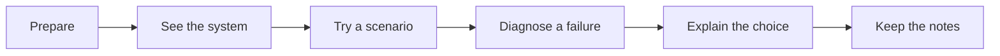

# AuVille AI Learning ✦

**Aura meets Visual, Interactive Learning, Labs & Exploration.**

> Learn · Apply · Verify · Defend · Improve
>
> Visual AI engineering lessons with RAG and agent labs, failure diagnosis

AuVille grew out of a software engineer's preparations for AI engineering. Each topic followed a familiar routine: read the material, ask AI to explain unfamiliar terms, sketch the flow in a notebook, and try a small example. It made sense that day. A few days later, the terms were still familiar, but explaining how the pieces worked together—or what to do when the system failed—was harder.

AuVille brings those scattered steps into a **self-taught AI Engineer roadmap**. Each topic starts with essential background and a visual mental model, then moves through a real-world scenario, a hands-on simulation, failure diagnosis, and review questions. The connected **Policy Assistant** project traces those ideas into code. The goal is to help learners move from recognizing a term to explaining it, using it, and defending their design choices. If it helps someone feel more prepared, it has done its job.

### Explore

| | Go to | What you will find |
| --- | --- | --- |
| 🌐 | [Open AuVille](https://auville-learning.vercel.app/) | The interactive learning app. |
| 🧭 | [Browse the AI Engineer roadmap](https://auville-learning.vercel.app/topics/) | A quick index of the topics. |
| 📖 | [Read the learning guide](assets/AuVille-AI-Learning-Guide.pdf) | A downloadable PDF for review. |
| 💻 | [Download the Policy Assistant project](https://auville-learning.vercel.app/assets/auville-ai-project.zip) | A local Python project with a cited RAG assistant and topic exercises. |

## Why AuVille?

- 🧠 **Recall the end-to-end picture.** Follow a topic from the terms and diagram through its real system path, failure points, and design choices.
- ⚡ **Get a useful first pass quickly.** Plain language and focused visuals make it possible to start in minutes without a long lecture or pages of theory.
- 🧪 **Check that it really clicked.** Scenarios, simulations, and failure diagnosis ask you to use the idea, not just recognize its name.
- 🎤 **Explain it clearly.** Short questions, trade-offs, and a project example help turn understanding into an answer you can defend.
- 📝 **Pick up where you left off.** Mark sections as learned and revisit the short notes when you need a refresher.

## The AI Engineer path

| Stage | Topics you will connect |
| --- | --- |
| **Understand models** | LLM fundamentals, prompt and context engineering, model evaluation. |
| **Build retrieval** | Ingestion, chunking, embeddings, vector search, RAG, grounding, and citations. |
| **Build agents** | Memory, agent loops, human review, tool calling, and MCP. |
| **Make it dependable** | Security, evaluation, guardrails, reliability, observability, cost, and deployment. |

## Inside a lesson: Basic RAG

The Foundation view connects a user's question to permitted retrieval, a bounded prompt, and an answer supported by citations.

[Open the interactive Basic RAG lesson →](https://auville-learning.vercel.app/?topic=Basic%20RAG)

## One learning loop

Beyond individual lessons, **System Stories** show how the roadmap fits into production workflows. The downloadable **Policy Assistant** connects the ideas in a local application. **AI Pulse** offers brief updates on recent AI developments.

## Future roadmaps

AuVille is updated twice a week. The AI Engineer roadmap is the starting point; planned paths will bring the same visual, hands-on learning loop to:

- **AI Engineering with .NET** — applying AI concepts in .NET applications.
- **AI Engineering with Java** — applying AI concepts in Java applications.

Have a topic, real project scenario, or clearer way to explain something? [Share your idea through AuVille](https://auville-learning.vercel.app/) or reach out if you would like to contribute directly. Suggestions from learners will help shape these roadmaps.

## License & security

- **License:** AuVille-authored source is available under the [MIT License](LICENSE). Bundled libraries and assets keep their own terms; see the app's [third-party notices](https://auville-learning.vercel.app/assets/third-party-notices.txt).
- **Learning site:** The deployed lessons use bundled content. No account or AI API key is needed to explore them. Learned progress and notes stay in the browser session; the theme preference stays on the device.
- **Feedback:** Opens an email draft that the learner chooses whether to send.
- **Downloadable project:** It runs locally with Ollama by default. OpenAI is optional with your own key in a local `.env` file. In OpenAI mode, questions and policy passages are sent to that provider; keep real keys out of the browser and Git.

AuVille is a learning resource for people building applied AI systems or preparing to explain them clearly. Suggestions are welcome through the app's feedback form.
